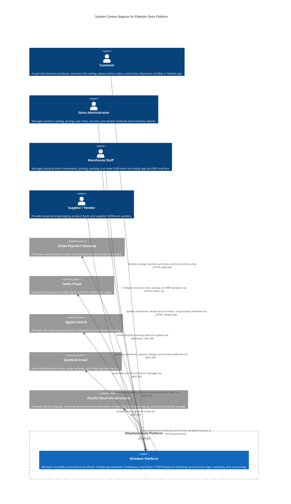

# C1 System Context - Elitedom Store

Document Classification: Internal  
Version: 1.0  
Status: Approved  
Owner: Solution Architecture  
Target System: Elitedom E-Commerce & Odoo 17 ERP Integration  

---

## 1. Introduction & Purpose
This document defines the Level 1 System Context (C1) diagram and narrative for the Elitedom Store platform using the C4 architectural model. It establishes the high-level boundary of the system, identifying the key human users (actors) who interact with it, and the external software systems it integrates with to deliver a complete e-commerce and enterprise resource planning solution.

---

## 2. System Context Diagram (Mermaid)

---

## 3. Scope and Boundaries

### 3.1 In Scope (The Elitedom Platform)
* Reactive Web Storefront & Mobile App: Client-facing applications allowing users to discover products, manage shopping carts, and execute secure checkouts.
* Middleware & Modular Monolith Backend: Custom Python application modules managing business domains, authentication, order processing, and event-driven communication.
* Odoo 17 ERP Backbone: The master system of record owning inventory management, procurement, sales orders, warehouse routing, and financial accounting.
* PostgreSQL Database: Primary relational data store managing all transactional records and audit logs.

### 3.2 Out of Scope (External Systems)
* Payment Processing (Stripe): Handling card tokenization, fraud detection, and banking transaction clearing.
* SMS & Communications (Twilio): Global carrier delivery of text messages and verification codes.
* Search Indexing (Algolia): External cloud-managed search index engine.
* Email Delivery (SendGrid): SMTP and API-based email dispatch infrastructure.
* Cloud Infrastructure (OCI): Virtual cloud networks, physical server hardware, and managed infrastructure services.

---
End of Document
