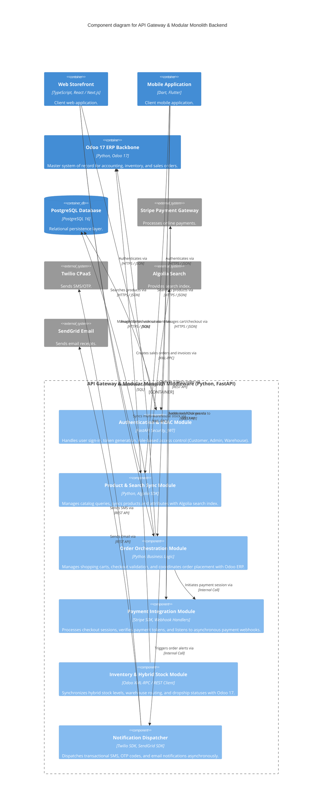

# C3 Component Architecture - Elitedom Store

Document Classification: Internal  
Version: 1.0  
Status: Approved  
Owner: Solution Architecture  
Target System: Elitedom E-Commerce & Odoo 17 ERP Integration  

---

## 1. Introduction & Purpose
This document defines the **Level 3 Component (C3)** architectural model for the **Elitedom Store** platform. It zooms into the primary backend container (**API Gateway & Modular Monolith Middleware**) to reveal its internal components, modules, service boundaries, and how they interact with external systems and the Odoo 17 ERP backbone.

---

## 2. Component Diagram (Mermaid)

---

## 3. Component Breakdown & Responsibilities

### 3.1 Authentication & RBAC Module
* **Technology:** FastAPI Security, PyJWT
* **Responsibility:** Manages user registration, login verification, JWT token issuance, and role-based access control ensuring strict permission segregation between Customers, Store Administrators, and Warehouse Staff.

### 3.2 Product & Search Sync Module
* **Technology:** Python, Algolia Python Client
* **Responsibility:** Handles product catalog requests, attribute filtering, and synchronizes product metadata and stock updates between Odoo 17 and Algolia search indices to ensure sub-100ms search latency.

### 3.3 Order Orchestration Module
* **Technology:** Python Business Logic Core
* **Responsibility:** Coordinates the end-to-end checkout flow, cart validation, price calculation, tax verification, and communicates with Odoo 17 to instantiate official sales orders and invoices.

### 3.4 Payment Integration Module
* **Technology:** Stripe Python SDK, Webhook Handlers
* **Responsibility:** Interacts with Stripe to create secure payment intents and checkout sessions, handling asynchronous webhook notifications (payment success, failure, refunds) to update order statuses.

### 3.5 Inventory & Hybrid Stock Module
* **Technology:** Odoo XML-RPC Client, Python Async Worker
* **Responsibility:** Manages the hybrid stock model, synchronizing real-time inventory counts between internal warehouses and dropship suppliers, and mapping stock movements within Odoo 17.

### 3.6 Notification Dispatcher
* **Technology:** Twilio SDK, SendGrid SDK, Celery / Async Workers
* **Responsibility:** Asynchronously dispatches transactional SMS alerts, OTP verification codes, and email receipts triggered by customer actions or order status updates.

---
End of Document
