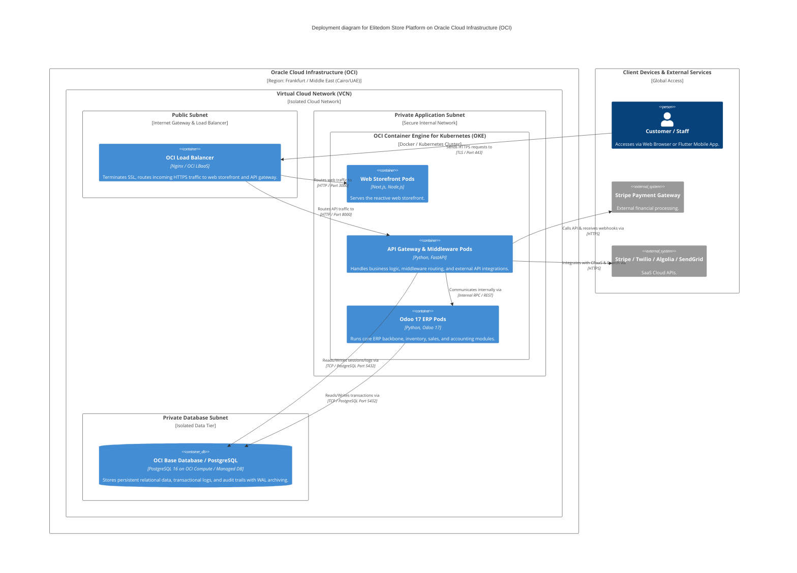

# C4 Deployment Architecture - Elitedom Store

Document Classification: Internal  
Version: 1.0  
Status: Approved  
Owner: Solution Architecture  
Target System: Elitedom E-Commerce & Odoo 17 ERP Integration  

---

## 1. Introduction & Purpose
This document defines the **Level 4 Deployment (C4)** architectural model for the **Elitedom Store** platform. It maps the software containers (Web Storefront, Mobile App Backend/Middleware, Odoo 17 ERP, PostgreSQL) onto the target physical and cloud infrastructure hosted on **Oracle Cloud Infrastructure (OCI)**.

---

## 2. Deployment Diagram (Mermaid)

---

## 3. Infrastructure & Deployment Topology

### 3.1 Load Balancing & Edge Tier (Public Subnet)
* **OCI Load Balancer:** Terminates TLS/SSL certificates, handles incoming traffic distribution, DDoS protection, and routes requests to the internal private subnets based on path rules.

### 3.2 Application & Compute Tier (Private Application Subnet / OKE)
* **OCI Container Engine for Kubernetes (OKE):** Orchestrates containerized Docker images for the Web Storefront, FastAPI Middleware, and Odoo 17 ERP backbone.
* Autoscaling policies scale pod replicas dynamically based on CPU and request volume during peak shopping seasons.

### 3.3 Database Tier (Private Database Subnet)
* **PostgreSQL on OCI:** High-performance database instance deployed in an isolated private subnet with automated daily backups and continuous Write-Ahead Log (WAL) archiving to OCI Object Storage (as defined in ADR-009).

---
End of Document
