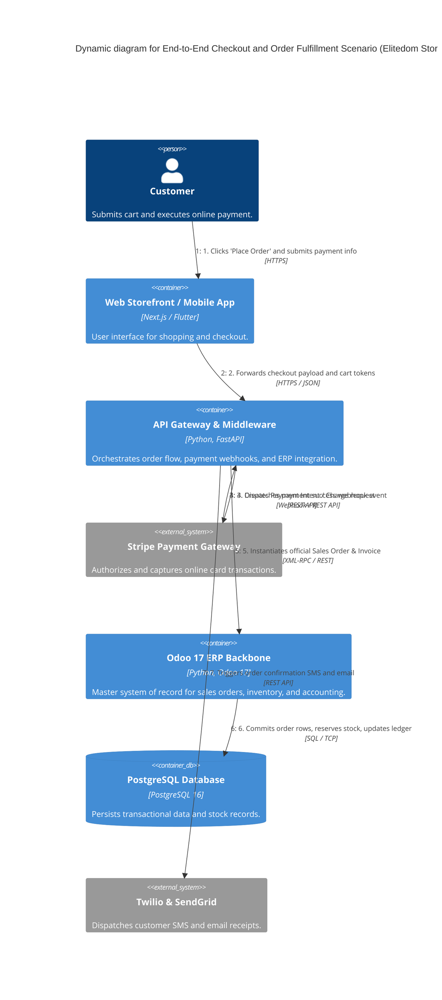

# C4 Dynamic Architecture - Elitedom Store

Document Classification: Internal  
Version: 1.0  
Status: Approved  
Owner: Solution Architecture  
Target System: Elitedom E-Commerce & Odoo 17 ERP Integration  

---

## 1. Introduction & Purpose
This document defines the **Level 4 Dynamic (C4 Dynamic)** architectural model for the **Elitedom Store** platform. It illustrates how the containers and components collaborate at runtime to execute a specific, critical business scenario: **End-to-End Checkout, Payment Processing, Odoo ERP Order Creation, and Notification Dispatch**.

---

## 2. Dynamic Diagram (Mermaid) - Checkout & Order Fulfillment Scenario

---

## 3. Step-by-Step Scenario Walkthrough

### Step 1 & 2: Order Submission
* The **Customer** reviews their cart on the **Web Storefront or Mobile App** and initiates checkout.
* The client application transmits the encrypted order payload and cart items to the **API Gateway & Middleware** (FastAPI).

### Step 3 & 4: Payment Processing & Webhook
* The **API Gateway** communicates with **Stripe** to authorize and capture the payment via a secure Payment Intent.
* Upon successful payment capture, **Stripe** asynchronously pushes a payment success webhook notification back to the **API Gateway**.

### Step 5 & 6: ERP Order Creation & Inventory Reservation
* Upon receiving the payment confirmation webhook, the **API Gateway** calls the **Odoo 17 ERP Backbone** via secure XML-RPC/REST APIs to create an official Sales Order and generate a digital invoice.
* **Odoo 17** processes the business rules, triggers the multi-warehouse stock routing (supporting the hybrid stock model), and commits the transaction rows to the **PostgreSQL Database**.

### Step 7: Notification Dispatch
* Simultaneously, the **API Gateway** invokes the **Notification Dispatcher** module to send a real-time order confirmation SMS via **Twilio** and an itemized invoice email via **SendGrid** to the customer.

---
End of Document
