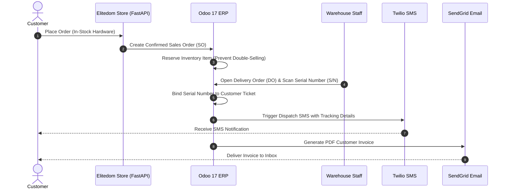
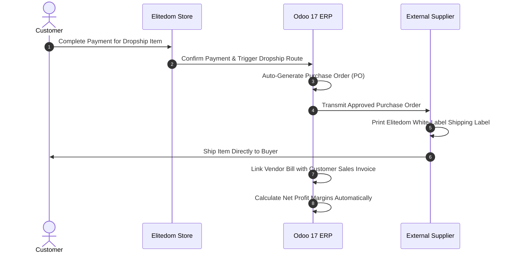
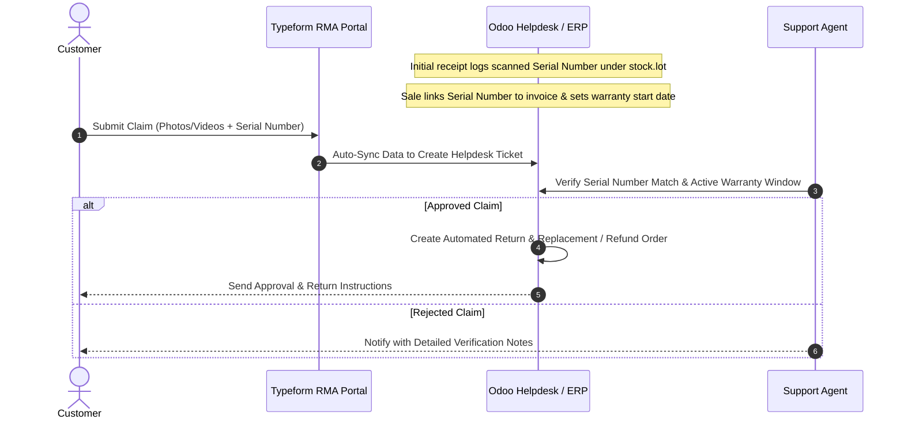
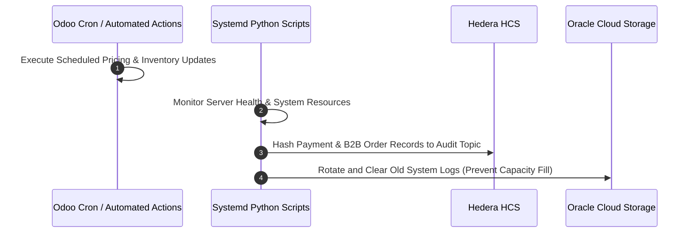

# Operational Workflows & Sequence Diagrams Specification (SEQUENCE_DIAGRAMS.md)

**Document Classification:** Internal / Architecture & Operations  
**Version:** 1.0  
**Status:** Approved / Production Ready  
**Target System:** Elitedom Store, Odoo 17 ERP, FastAPI, Twilio, SendGrid, Typeform, Hedera HCS  

---

## 1. Executive Summary & Overview
This document defines the sequence diagrams and operational interactions for the core business workflows of the **Elitedom Store** integrated within **Odoo 17 ERP**. It outlines step-by-step communication between customers, e-commerce storefronts, ERP modules, third-party communication channels (Twilio, SendGrid, Typeform), and decentralized ledger networks (Hedera HCS).

---

## 2. Direct Retail Workflow (In-Stock Hardware)
*Applies to hardware inventory stored in local warehouse facilities.*

---

## 3. Automated Dropshipping Workflow
*Applies to supplier-owned inventory shipped directly from vendors to customers.*

---

## 4. Serial Tracking & RMA Warranty Workflow
*Protects both customer rights and store inventory against fraudulent returns.*

---

## 5. Background Automation & Maintenance Workflow

---
End of Document
